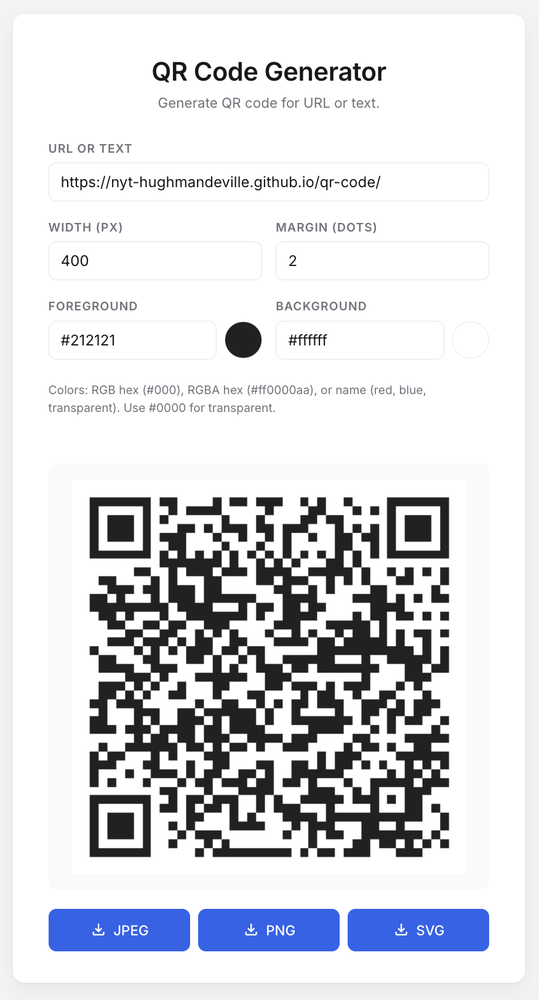

# QR Code Generator

This is a simple QR code generator built using client-side JavaScript only. It allows you to create QR codes for URLs or text. It lets you choose the color and size of the QR code. And it lets you choose the output format to download as (JPEG, PNG, or SVG).

<https://nyt-hughmandeville.github.io/qr-code/>



## Colors

For the color values use hex RBG or RGBA values, or common names for colors (e.g. red, #f00, f007, #ff0000, #ff0000f7). Use #0000 for transparent. You can also use the color selector to choose a color.

## Run locally

```sh
make serve     # http://localhost:8080
make open      # open the running site in your browser
```

`make serve` uses Python 3's built-in `http.server`. Any static web server works — opening `index.html` directly via `file://` will not load the QR library because of browser ESM/CORS restrictions.

## Deploy to GitHub Pages

1. Push `main` to GitHub.
2. [Repo → **Settings → Pages**](https://github.com/nyt-hughmandeville/qr-code/settings/pages).
3. Source: **Deploy from a branch**, Branch: `main` / `(root)`, Save.
4. Site goes live at (https://nyt-hughmandeville.github.io/qr-code/).

No build step or workflow file is required — every file is static.

## Implementation

- (index.html) — markup
- (style.css) — styles
- (app.js) — ES module that imports [`qrcode@1.5.4`](https://www.npmjs.com/package/qrcode) from [esm.sh](https://esm.sh) (an ESM CDN for npm packages) and wires up the form, canvas, and downloads
- [Material Symbols icons](https://fonts.google.com/icons) loaded from [Google Fonts](https://fonts.google.com/).
